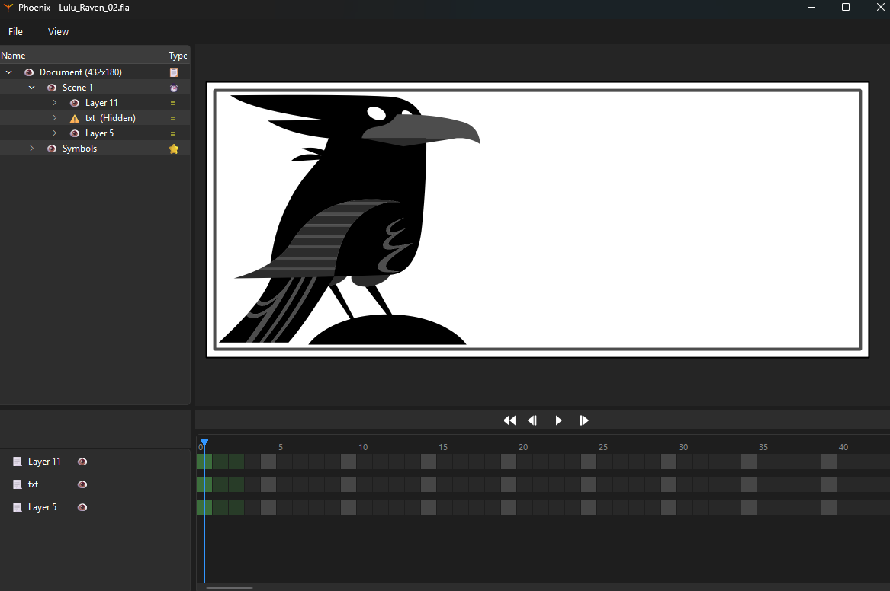

# Pheonix

Phoenix is an experimental Flash FLA parser and renderer. It is being developed out of personal interest as a learning exercise and is not intended to be a supported product.

The GUI and rendering is implemented with Qt.

Ideally the shape rendering code could be extracted and abstracted to support rendering with other frameworks.

Performance has not been a focus yet over accuracy.

## [FLA Format Documentation](docs/FLA_FORMAT.md)
