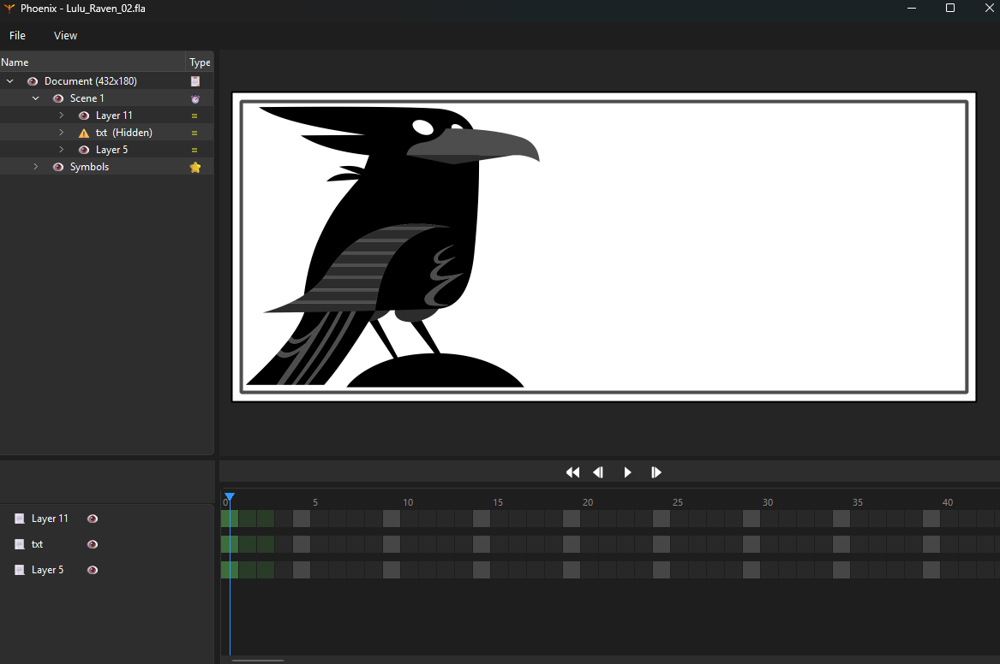

# Pheonix

Phoenix is an experimental Flash FLA parser and renderer. It is being developed out of personal interest as a learning exercise and is not intended to be a supported product.



Performance has not been a focus yet over accuracy.

## Building

### Requirements

- CMake 3.16 or newer
- A C++17 compiler
- Qt 6, with the Widgets and Svg modules
- Git and a network connection for the first configure: the ActionScript parser
  ([libas3](https://github.com/brendan-duncan/libas3)) is fetched at configure
  time. zlib and tinyxml2 are vendored under `src/third_party` and need nothing.

### Configure and build

```
cmake -S . -B build -G "Visual Studio 18 2026" -A x64
cmake --build build --config Debug
```

Substitute your own generator; `"Visual Studio 17 2022"` works the same way.

On Windows, prefer a Visual Studio generator over Ninja. Ninja currently fails
in the libas3 dependency, which copies `as3_parser.pdb` after archiving — MSVC
does not emit that file for a static library under Ninja, so the copy errors out
before Phoenix itself is reached.

A Visual Studio generator also finds the MSVC toolchain by itself, so it works
from an ordinary shell. Ninja does not: it needs the compiler already on `PATH`,
which means a Developer Command Prompt, or a shell that has run `vcvars64.bat`.

### Finding Qt

The build looks for Qt in this order, and stops at the first that works:

1. `-DQt6_ROOT=...` or `-DCMAKE_PREFIX_PATH=...` on the command line
2. the `Qt6_ROOT` or `QTDIR` environment variables
3. on Windows, the newest `C:/Qt/6.*/msvc*_64` it can find

If none of those turn up Qt, configuring fails with a message saying how to
point it at one. To be explicit:

```
cmake -S . -B build -DQt6_ROOT=C:/Qt/6.11.2/msvc2022_64
```

## Tests

Building the top-level project builds the tests too, as the `phoenix_tests`
target:

```
ctest --test-dir build -C Debug --output-on-failure
```

Drop `-C Debug` with a single-config generator such as Ninja or Unix Makefiles.

That reports two tests, because libas3 registers its own suite alongside
Phoenix's. Add `-R phoenix_tests` to run only Phoenix's.

The editing model, the geometry and the path parser and writer need neither Qt
nor the file readers, so their tests also build on their own — useful when Qt is
not installed:

```
cmake -S tests -B build-tests
cmake --build build-tests --config Debug
ctest --test-dir build-tests -C Debug --output-on-failure
```

That leaves out the tests covering the XML and zip readers, which the top-level
build supplies: 177 tests standalone against 200 from the full build.

Some tests exercise real documents rather than hand-built ones — checking that
files round-trip through the writer unchanged, and that the shape arrangement
agrees with the topology the files encode. They are skipped unless pointed at a
folder of `.fla` files or extracted XFL directories:

```
set PHOENIX_FLA_CORPUS=path/to/fla/files
```

## [FLA Format Documentation](docs/FLA_FORMAT.md)
